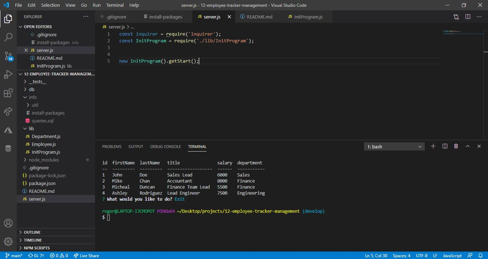

# Employee tracker management App

## Description 

An application that can be used to manage the company's employee database.

You can check/view all information that is contained in the database via and interface develop in this application

It has developed with Node.js, MySQL Database, Inquirer and MySQL2 packages and ES6.

## Table of Contents

* [URLs](#urls)
* [Installation](#installation)
* [Usage](#usage)
* [Contributing](#Contributing)
* [License](#license)
* [Test](#Test)
* [Questions](#questions)
* [Screenshots](#screenshots)

## URLs

* GitHub Repository:
    - [HTTPS: https://github.com/rogers0404/12-employee-tracker-management.git](https://github.com/rogers0404/12-employee-tracker-management.git)    
    - [GIT: git@github.com:rogers0404/12-employee-tracker-management.git](git@github.com:rogers0404/12-employee-tracker-management.git)

* Link Video
    - [Youtube Video: https://youtu.be/66aD5Yslw_Y](https://youtu.be/66aD5Yslw_Y)
    - [Google Drive Video: https://drive.google.com/file/d/1L_ZzRqjHDop5IUXWi7qdfTzaSazX2p2V/view](https://drive.google.com/file/d/1L_ZzRqjHDop5IUXWi7qdfTzaSazX2p2V/view)

## Installation

You need some packages to run this application, 

- `git clone git@github.com:rogers0404/11-note-taker.git        //clone the repository`
- `npm i                                   // or npm install to get all packages and dependencies of NPM`
- `npm init                                // to get package.json`
- `npm install jest --save-dev             // Install the code testing Jest`
- `npm install --save mysql2               // Install npm package for MySQL`
- `npm install inquirer                    // Install npm Inquirer package`
- `npm install console.table --save        // Install npm console.table to give table format to SQL queries `
- `mysql -u root -p                        // Initial Setting to Database`
- `Inside mysql you must run the following command line. source db/schema.sql and source seeds.sql`

## Usage 

Defining Express in the application:

`const inquirer = require('inquirer');`
`const mysql = require('mysql2');`
`const cTable  = require('console.table');`
`const Employee = require('./Employee');`
`const Department = require('./Department');`

The starting command-line is:

`npm start                                 // to run the server`
`npm test                                  // to test the code with jest`
`mysql -u root -p                          // Initial Setting to Database`

Examples of methods to execute queries in async way:

`finishConnection() {               `
`       connection.end();           `
`    }                              `

`  viewAllQuery(str){                                           `
`       const query =  connection.promise()                     `
`                       .query(str)                             `
`                       .then(([rows,fields]) => {              `
`                           console.log('\n');                  `
`                            console.table(rows);               `                        
`                       })                                      `
`                        .catch((err) =>  console.log(err));    `
`    };                                                         `

`    deleteQuery(str){                                              `
`        const query =  connection.promise()                        `
`                        .query(str)                                `
`                        .then(([rows,fields]) => {                 `
`                            console.log('\n');                     `
`                            console.log(' Register Deleted!\n');   `
`                        })                                         `
`                        .catch((err) =>  console.log(err));        `
`    };                                                             `

## Contributing

* Rogers Ramirez, Github User: [rogers0404](http://github.com/rogers0404)

## License

Employee tracker management App with Node.js and MySQL2 is licensed under the

None

console.table Dependency is licensed under the

MIT

Inquirer Dependency is licensed under

Copyright (c) 2016 Simon Boudrias (twitter: @vaxilart) Licensed under the MIT license.

## Test

the Objects created are tested with Jest Package

`npm test                                  // to test the code with jest`

Queries are tested inside package MySQL2

## Questions

If you have any questions about the application, you can check the documentation on my GitHub profile [https://github.com/rogers0404](https://github.com/rogers0404).

for more information you can have a question via email [rogers.ramirez2008@gmail.com](rogers.ramirez2008@gmail.com)  .

## Screenshots

### Screenshot 1

